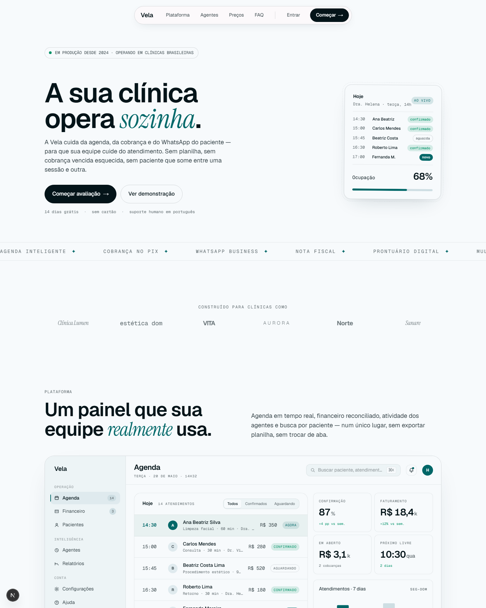
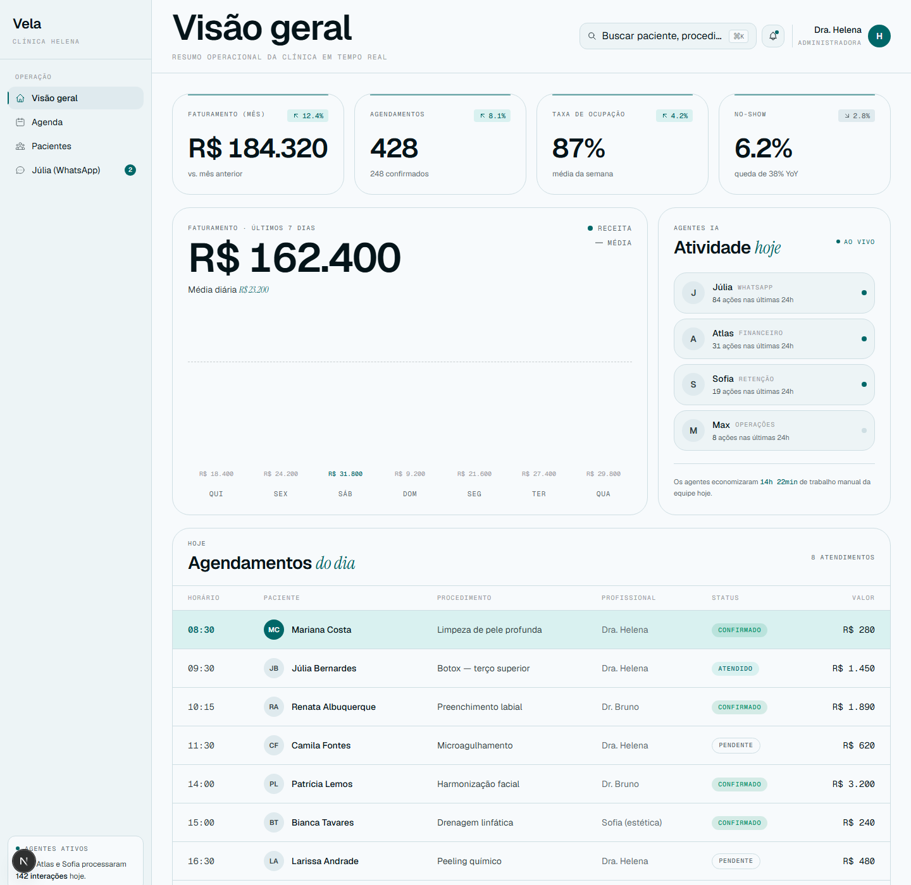

# Vela

> Sua clínica opera sozinha. A plataforma e os agentes que cuidam da agenda, da cobrança e do WhatsApp do paciente — para que sua equipe cuide do atendimento.

Vela é um SaaS para clínicas brasileiras que combina painel de gestão em tempo real com agentes de IA especializados (Júlia · agenda, Sofia · cobrança, Max · atendimento, Atlas · análise). Este repositório contém o site de venda + a app de produção (atualmente rodando em `/demo`; será empacotada como desktop app com Tauri quando for pra produção).



## A app

A rota `/demo` é o app real — não uma demonstração descartável. Toda melhoria nela é trabalho de produto. Quando estiver pronto pra distribuir, será empacotado com [Tauri](https://tauri.app) e baixado pelos clientes após o pagamento da mensalidade.



**Rotas implementadas:**

- [`/demo`](http://localhost:3000/demo) — **Visão geral.** KPIs de faturamento, ocupação e no-show · gráfico de receita semanal · painel ao vivo dos agentes · agendamentos do dia.
- [`/demo/agenda`](http://localhost:3000/demo/agenda) — **Agenda.** Grade semanal com status colorido por atendimento, indicador do dia atual, estatísticas de ocupação e lista de espera.
- [`/demo/pacientes`](http://localhost:3000/demo/pacientes) — **Pacientes.** Base filtrável por tag (VIP · ativo · novo · inativo), busca por nome, LTV e ticket médio.
- [`/demo/julia`](http://localhost:3000/demo/julia) — **Júlia.** Inbox do agente de WhatsApp com conversas mockadas em pt-BR, typing indicator e botão de assumir conversa.

Todas as 4 rotas seguem [`design.md`](design.md) à risca — mesma paleta, mesma tipografia, mesma disciplina de superfície.

## Sistema de design

O design da Vela está travado em [`design.md`](design.md) — gerado pelo skill [Hallmark](https://www.usehallmark.com) via `study` do exemplo Tally, adaptado para a marca Vela na revisão 2 (paleta deep-teal, sem gradientes, wordmark sem ícone).

**Resumo:**

| Eixo | Decisão |
|---|---|
| Genre | modern-minimal |
| Macrostructure | Marquee Hero + Workbench live-demo |
| Theme | studied-DNA (deep teal) |
| Paper | `oklch(98.4% 0.004 220)` — near-white cool-tinted |
| Ink | `oklch(18.0% 0.025 220)` — near-black cool-tinted |
| Accent | `oklch(45.0% 0.110 195)` — deep teal (companion: nenhum) |
| Display + body | Geist (300–700) |
| Mono / labels | Geist Mono |
| Italic accent | Instrument Serif italic (1 palavra por título, em teal) |
| Motion library | nenhuma — apenas CSS keyframes + transitions |

A fonte da verdade é [`tokens.css`](tokens.css). As páginas referenciam tokens por nome — nada inline, nada de gradiente, nada de surpresa.

## Stack

- **Next.js 16** App Router · React 19
- **TypeScript** strict
- **Tailwind CSS 4** com `@theme inline` referenciando os tokens
- **Prisma + PostgreSQL** (auth e persistência)
- **NextAuth.js** (autenticação)
- **OpenAI SDK** (agentes)

## Rodando localmente

```bash
npm install
npm run dev
```

- [`http://localhost:3000`](http://localhost:3000) — site de venda
- [`http://localhost:3000/demo`](http://localhost:3000/demo) — demonstração interativa do dashboard

## Estrutura

```
.
├── design.md                    # sistema de design travado (leia primeiro)
├── tokens.css                   # fonte da verdade dos tokens
├── docs/
│   ├── hero.png                 # screenshot do site de venda
│   ├── demo-overview.png        # screenshot da Visão geral
│   ├── demo-agenda.png          # screenshot da Agenda
│   ├── demo-pacientes.png       # screenshot dos Pacientes
│   └── demo-julia.png           # screenshot da Júlia
├── .hallmark/
│   ├── log.json                 # memória do skill Hallmark (builds anteriores)
│   └── preflight.json           # snapshot da pré-flight scan
├── src/
│   ├── app/
│   │   ├── layout.tsx           # carrega Geist + Geist Mono + Instrument Serif
│   │   ├── globals.css          # importa tokens.css + Tailwind v4 @theme
│   │   ├── home.css             # estilos do landing (mirroring Tally architecture)
│   │   ├── page.tsx             # landing (Marquee Hero + Workbench demo)
│   │   ├── plataforma/          # módulos (route legacy — em refator)
│   │   ├── agentes/             # apresentação dos agentes
│   │   ├── planos/
│   │   ├── sobre/
│   │   ├── entrar/
│   │   ├── solicitar-acesso/
│   │   └── demo/                # demonstração interativa do dashboard
│   ├── components/              # Navbar, Footer, Button compartilhados
│   └── generated/prisma/        # cliente Prisma (não versionado)
```

## Roadmap

- [x] Site de venda (Marquee Hero + Workbench demo · revisão 2)
- [x] Sistema de design travado (`design.md`)
- [x] App de produção rodando em `/demo` — 4 rotas no sistema de design Vela
- [ ] Animações do site de venda
- [ ] Refator das rotas legacy (entrar, planos, plataforma, agentes, sobre) para o novo design system
- [ ] Onboarding wizard ("tão fácil quanto bebê" — clínica → calendário → WhatsApp → agente → equipe)
- [ ] Autenticação real (NextAuth + Prisma)
- [ ] Integração WhatsApp Business API (Júlia em produção)
- [ ] Pipeline de cobrança Pix (Sofia em produção)
- [ ] Conciliação automática (Atlas)
- [ ] Empacotamento desktop com Tauri + auto-update

## Trabalhando no design

Quando alterar tokens, edite [`tokens.css`](tokens.css). Quando o sistema mudar de forma significativa, atualize [`design.md`](design.md) — futuras execuções do Hallmark leem esse arquivo primeiro e seguem o que está nele.

Para regenerar a screenshot acima depois de mudanças:

```powershell
# com o dev server rodando em localhost:3000:
& "C:\Program Files (x86)\Microsoft\Edge\Application\msedge.exe" `
  --headless --disable-gpu `
  --screenshot="$PWD\docs\hero.png" `
  --window-size=1440,1800 `
  --hide-scrollbars `
  http://localhost:3000
```

## Licença

Ver [LICENSE](LICENSE).
